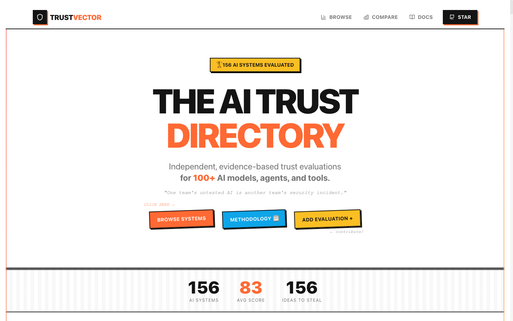

<div align="center">

# 🛡️ TrustVector

### Trust scores for the entire AI stack — models, agents, and MCP servers.

**Benchmarks tell you how smart an AI is. TrustVector tells you whether you can trust it in production.**

[](https://opensource.org/licenses/MIT)
[](#-current-coverage)
[](/data/models)
[](/data/agents)
[](/data/mcps)
[](http://makeapullrequest.com)
[](https://github.com/guard0-ai/TrustVector)

🌐 **[trustvector.dev](https://trustvector.dev)** · 📖 **[Methodology](/docs/METHODOLOGY.md)** · 🤝 **[Contribute](/CONTRIBUTING.md)** · 🗺️ **[Roadmap](/ROADMAP.md)**



</div>

---

## 🚨 What our data found (June 2026)

This isn't a list of logos. Every entry is an evidence-linked evaluation across **security, privacy, performance, transparency, and operations** — and the findings are uncomfortable:

- ⚠️ **21 of 60 models** in the registry are **retired, deprecated, superseded, or were never released** — including models still hardcoded in thousands of production apps (Grok 3 now *silently redirects* to a different model; Gemini 2.0 Flash was shut down June 1).
- 🩸 **Archived MCP reference servers ship unpatched SQL injection.** The Postgres reference server was still pulling ~21k weekly downloads *after* being archived with a known SQLi — we score it 51/100 on security so you don't find out the hard way.
- 🕳️ **Popularity ≠ safety.** Context7 (57k★, the most-starred MCP server on GitHub) scores 86/100 on performance but **59/100 on security** after the "ContextCrush" registry-poisoning vulnerability. Playwright MCP: 88 performance, 60 security.
- 🔓 **The agent you let browse the web matters.** General-purpose autonomous agents score as low as **50/100 on privacy** in our registry; sandboxed, permission-gated coding agents score 20+ points higher.
- ⏳ **The OpenAI Assistants API sunsets August 26, 2026.** If you're on it, your migration window is measured in weeks. It's flagged.

**Every one of these claims links to a primary source with a date.** That's the whole point.

---

## 📊 Frontier models, scored on what benchmarks ignore

Overall = mean of 5 dimension scores. Full criteria, evidence URLs, and confidence levels in each JSON file.

| Model | Overall | Perf | Security | Privacy | Transparency | Ops |
|---|:---:|:---:|:---:|:---:|:---:|:---:|
| **Claude Fable 5** (Anthropic) | **92** | 98 | 92 | 93 | 88 | 91 |
| **Claude Opus 4.8** (Anthropic) | **92** | 96 | 92 | 93 | 88 | 91 |
| **GPT-5.5** (OpenAI) | **91** | 97 | 89 | 87 | 90 | 94 |
| **Gemini 3.1 Pro** (Google) | **91** | 96 | 88 | 88 | 88 | 93 |
| **Mistral Large 3** (Mistral, open) | **85** | 88 | 83 | 87 | 80 | 86 |
| **Grok 4.3** (xAI) | **83** | 94 | 83 | 76 | 82 | 82 |
| **DeepSeek-V4** (open) | **83** | 92 | 83 | 78 | 80 | 83 |
| **GLM-5** (Z.ai, open) | **82** | 92 | 80 | 75 | 81 | 83 |
| **Kimi K2.6** (Moonshot, open) | **81** | 91 | 79 | 75 | 80 | 82 |

Notice the spread: models within 5 points of each other on *capability* differ by **15+ points on privacy and security**. If you're choosing a model for healthcare, legal, or finance, the right-hand columns are the ones that get you fired.

And it's not just models — the same lens on **coding agents** (Claude Code 80, OpenAI Codex 82, Devin 71, Manus 64) and **MCP servers** (GitHub 82, Playwright 80, Context7 79, archived Postgres 72) exposes exactly where the trust gaps are.

<div align="center">

</div>

---

## 🎯 Why this exists

Leaderboards answer *"which model is smartest?"* Nobody was answering:

- Can this model touch **PHI under HIPAA**? What's its actual data-retention policy — with a link?
- Is this MCP server **maintained**, or was it quietly archived with an open CVE?
- Does this agent framework **sandbox tool execution**, or does prompt injection mean shell access?
- Is this API **deprecated**, and what's the shutdown date?

TrustVector evaluates every entity across **5 dimensions** — like a CVSS score for AI systems:

| Dimension | What it covers |
|---|---|
| ⚡ **Performance & Reliability** | Benchmarks, latency, uptime, context limits |
| 🔒 **Security** | Prompt-injection resistance, jailbreaks, sandboxing, CVE history |
| 🔐 **Privacy & Compliance** | Data residency, retention, training opt-out, HIPAA/GDPR/SOC 2 |
| 🔍 **Trust & Transparency** | Hallucination rate, explainability, model cards, open source |
| 🛠️ **Operational Excellence** | API/SDK quality, versioning policy, ecosystem, support |

Three rules make it trustworthy:

1. **Every score has evidence** — a primary source URL, a date, and a methodology.
2. **Every score has a confidence level** — high / medium / low. We tell you when we're not sure.
3. **Everything is a JSON file in git** — disagree with a score? Open a PR with better evidence. That's the protocol.

---

## ⚡ 30-second start

```bash
git clone https://github.com/guard0-ai/TrustVector.git
cd TrustVector && npm install && npm run dev   # → http://localhost:3000
```

Or skip the website — the data is just JSON:

```typescript
import fable5 from './data/models/claude-fable-5.json';

fable5.trust_vector.security.overall_score;                     // 92
fable5.trust_vector.privacy_compliance.criteria.data_retention; // evidence, URL, date, confidence
fable5.use_case_ratings['healthcare'];                          // { overall, notes, alternatives }
```

### Weight it like CVSS — your risk profile, your score

```typescript
import { calculateCustomScore, WEIGHTING_PROFILES } from '@/framework/calculator/custom-score';

calculateCustomScore(entity, WEIGHTING_PROFILES.healthcare);   // HIPAA-weighted
calculateCustomScore(entity, WEIGHTING_PROFILES.security_first);

// or roll your own
calculateCustomScore(entity, {
  performance_reliability: 0.20,
  security: 0.30,
  privacy_compliance: 0.25,
  trust_transparency: 0.15,
  operational_excellence: 0.10,
});
```

Predefined profiles: `balanced` · `security_first` · `performance_focused` · `enterprise` · `healthcare` · `financial` · `startup`

---

## 📦 Current Coverage

**156 evaluations** across 3 categories (last refreshed June 2026 — yes, including the models that launched *this month*):

<details>
<summary><b>🧠 AI Models (60)</b> — Claude Fable 5 → archived also-rans, all scored</summary>

**Frontier:** Claude Fable 5, Opus 4.8/4.7/4.6/4.5, Sonnet 4.6/4.5, Haiku 4.5 · GPT-5.5, GPT-5.4, GPT-5.3-Codex, GPT-5.2, GPT-5.1, GPT-5, o-series · Gemini 3.1 Pro, Gemini 3.5 Flash, Gemini 3 · Grok 4.3, Grok 4.1 · Nova 2 Lite, Nova Pro

**Open-weight:** DeepSeek V4 / V3.2 / R1 · Qwen3.5 · Kimi K2.6 · GLM-5 · MiniMax-M2 · Mistral Large 3 · Command A+ · Gemma 4 / 3 · gpt-oss-120b/20b · Llama 4 / 3.x · Nemotron

**[Browse all models →](/data/models)**
</details>

<details>
<summary><b>🤖 AI Agents (50)</b> — coding agents, frameworks, enterprise platforms</summary>

**Coding & autonomous:** Claude Code, Claude Agent SDK, OpenAI Codex, Devin, Cursor, GitHub Copilot coding agent, Google Jules, Gemini CLI, Manus

**Frameworks:** OpenAI Agents SDK, Google ADK, Microsoft Agent Framework, AWS Strands, LangGraph, CrewAI, LlamaIndex, Pydantic AI, smolagents, Mastra, Dify

**Enterprise:** Amazon Bedrock Agents, Azure Bot Service, Gemini Enterprise Agent Platform, IBM watsonx Assistant, Dialogflow, Lex, and more — plus deprecated/archived projects (Swarm, AgentGPT, BabyAGI…) clearly flagged

**[Browse all agents →](/data/agents)**
</details>

<details>
<summary><b>🔌 MCP Servers (46)</b> — incl. security advisories on archived servers</summary>

**Top ecosystem:** Context7, Chrome DevTools MCP, Playwright MCP, Serena

**Official vendor:** GitHub, Figma, Stripe, Notion, Vercel, Hugging Face, Zapier, Apify, Firecrawl, shadcn

**Reference:** the 7 actively maintained servers (fetch, git, filesystem, memory, time, sequential-thinking, everything) — plus the **archived** ones (Puppeteer, Postgres, SQLite, Slack, …) flagged with security advisories so you don't `npx` your way into a CVE

**[Browse all MCPs →](/data/mcps)**
</details>

---

## 🤝 Contribute an evaluation (it's just a PR)

The registry stays honest because anyone can challenge it. Add or update an evaluation:

```bash
# 1. Start from an existing evaluation as your template
cp data/models/claude-fable-5.json data/models/your-model-name.json

# 2. Fill in scores — every score needs evidence (source, URL, date) + confidence level

# 3. Validate against the schema
npm run validate

# 4. Open a PR
git checkout -b evaluation/your-model-name && git add data/ && git commit -m "Add evaluation for X"
```

We review within 48 hours. Found a score you disagree with? **Bring a better source and open a PR** — that's how the system is supposed to work. See [CONTRIBUTING.md](/CONTRIBUTING.md).

### Scoring scale

| Range | Meaning |
|---|---|
| 90–100 | Exceptional — industry leading |
| 75–89 | Strong — meets enterprise requirements |
| 60–74 | Adequate — usable with caveats |
| 40–59 | Concerning — significant gaps |
| 0–39 | Poor — not recommended |

Full scoring rules, confidence definitions, and evidence requirements: [METHODOLOGY.md](/docs/METHODOLOGY.md)

---

## 🆚 How it compares

| | **TrustVector** | Leaderboards | Vendor model cards |
|---|:---:|:---:|:---:|
| Security & privacy scored | ✅ | ❌ | ⚠️ self-reported |
| Evidence URL on every score | ✅ | ⚠️ | ❌ |
| Confidence levels | ✅ | ❌ | ❌ |
| Covers agents & MCP servers | ✅ | ❌ | ❌ |
| Flags deprecated/archived/CVE'd entries | ✅ | ❌ | ❌ |
| Custom CVSS-style weighting | ✅ | ❌ | ❌ |
| Disagreement protocol | PR with sources | ❌ | ❌ |
| License | MIT, all data in git | varies | proprietary |

---

## 🏗️ Project structure

```
trustvector/
├── data/               # The registry — one JSON file per evaluation
│   ├── models/         # 60 model evaluations
│   ├── agents/         # 50 agent evaluations
│   ├── mcps/           # 46 MCP server evaluations
│   └── use-cases/      # Use-case taxonomy (healthcare, finance, …)
├── framework/          # Schema, Zod validation, custom-score calculator
├── app/                # Next.js site (static export, zero tracking)
└── scripts/            # CI validation — every PR is schema-checked
```

**TrustVector itself collects nothing:** no cookies, no tracking, static site generation, every evaluation version-controlled and validated in CI.

---

## ⭐ Star history

If TrustVector saved you from a deprecated API, an archived dependency, or a compliance surprise — star the repo. Stars are how more teams find out their MCP server has a CVE.

[](https://star-history.com/#guard0-ai/TrustVector&Date)

---

## 🙏 Acknowledgments

Methodology inspired by [CVSS](https://www.first.org/cvss/), [OWASP LLM Top 10](https://owasp.org/www-project-top-10-for-large-language-model-applications/), [RiskRubric.ai](https://riskrubric.ai/), and [LMSYS Chatbot Arena](https://lmsys.org/). Built with Next.js, TypeScript, Tailwind, Recharts, and Zod.

## 📬 Community

- 🐛 [Issues](https://github.com/guard0-ai/TrustVector/issues) — bugs and evaluation corrections
- 💬 [Discussions](https://github.com/guard0-ai/TrustVector/discussions) — questions and proposals
- 🔒 [SECURITY.md](/SECURITY.md) — report vulnerabilities
- 🗺️ [ROADMAP.md](/ROADMAP.md) — what's next

## 📜 License

MIT — see [LICENSE](/LICENSE). The data is yours to build on.

---

<div align="center">

**[⭐ Star on GitHub](https://github.com/guard0-ai/TrustVector)** · **[🤝 Contribute an evaluation](/CONTRIBUTING.md)** · **[📖 Read the methodology](/docs/METHODOLOGY.md)**

Made with ❤️ by [Guard0.ai](https://guard0.ai) and the TrustVector community

*Trust, but verify — then version-control the verification.*

</div>
